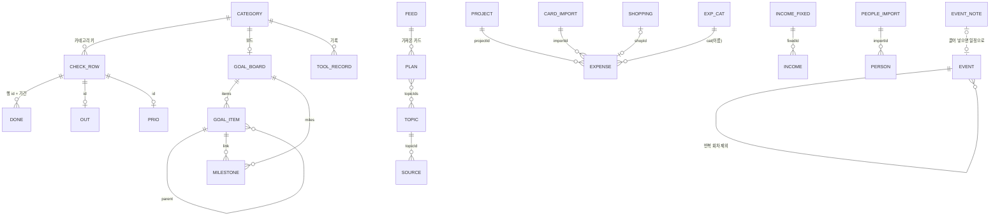

# Jcalender ERD 설계서

기준: 2026-09-30, 커밋 0bf034a (기획 보드 API 가져오기까지)

## 1. 개요

- 목적: 지금까지 만든 기능이 어떤 데이터를 어떻게 저장하고 서로 연결하는지 한 곳에 정리한다.
- 저장 방식: 서버 DB 없이 브라우저 localStorage 에 JSON 문서 1개로 저장한다.
  - 앱 데이터 키: `lifeboard.react.v1` (아래 모든 엔티티가 이 문서 안에 있다)
  - OneDrive 로그인 토큰만 별도 키: `jcalender.onedrive.token` (백업·내보내기에 섞이지 않도록)
- 표기
  - PK: 각 항목의 `id` (앱에서 만든 짧은 무작위 문자열)
  - FK: 다른 항목의 `id` 를 글자로 들고 있는 필드 (DB 제약은 없고 앱 코드가 지킨다)
  - 카테고리 키: `영역|카테고리` 문자열 (예: `W|기획·조사`). 영역은 P 개인 · W 근로 · B 사업
  - 날짜 `YYYY-MM-DD`, 시각 `HH:MM`, 금액은 원 단위 정수

## 2. 안건 (도메인별 엔티티 목록)

| 도메인 | 엔티티 | 저장 위치 |
|---|---|---|
| 체크리스트(공통) | CHECK_ROW(코드 고정), DONE, OUT, PRIO, RUN_LOG, REVIEWED, RULES | `data.js` RAW, `store.done/outs/prio/log/reviewed/rules` |
| 캘린더 | EVENT(반복 포함), EVENT_NOTE | `store.events`, `store.eventNotes` |
| 기념일 · D-day | ANNIV, DDAY | `store.anniv`, `store.ddays` |
| 인맥 | PERSON, PEOPLE_IMPORT | `store.people`, `store.peopleImport` |
| 개인 재무 | EXPENSE, INCOME, INCOME_FIXED, SHOPPING, PROJECT, EXP_CAT, CARD_IMPORT, REPORT | `store.finance.*` |
| 건강 | WORKOUT, SLEEP, MEAL, VISIT, HEALTH_IMPORT | `store.health.*` |
| 목표 | GOAL_BOARD, GOAL_ITEM(WBS), MILESTONE | `store.goals.boards[카테고리 키]` |
| 기획 · 조사 | TOPIC, SOURCE, PLAN, FEED | `store.plan.*` |
| 근로 · 사업 도구 | TOOL_RECORD (카테고리별 설정형 표) | `store.tools[카테고리 키]` |
| 저널링 | JOURNAL_ENTRY, WEEK_REVIEW | `store.journal.*` |
| 학습 · 여가 | LEARN_APP(앱 연동), STUDY_SUBJECT, STUDY_LOG | `store.learn`, `store.study[카테고리 키]` |
| 연동 설정 | ONEDRIVE, CARD_AI | `store.onedrive`, `store.cardAi` |
| 화면 설정 | BOARD_VIEW, FINANCE_UI, PLAN_UI | `store.boardView`, `finance.ui`, `plan.ui` |

## 3. 안건 별 주요 내용

### 3-1. 전체 관계도

### 3-2. 체크리스트 (공통 축)

| 엔티티 | 필드 | 설명 |
|---|---|---|
| CHECK_ROW | id(PK, 예 `WD3`), a(영역), c(주기 D·S·W·M·Y), cat, item, action, ty(API·AI·없음), detail | `data.js` RAW 문자열에서 만든다. id 는 주기 안 줄 순서라 숨긴 줄도 번호를 센다 |
| DONE | 키 `행id@기간키`(PK), at | 기간키: 일 2026-09-30, 주 2026-W40, 월 2026-09, 년 2026 |
| OUT | 키 행id(PK), 실행 결과 | API·AI 액션 실행 결과 |
| PRIO | 키 행id(PK), 1~3 | 우선순위 바꾼 것만 저장 |
| RUN_LOG | at, a, item, action, ty | 최근 40개 |
| REVIEWED | 키 카테고리 키, 날짜 | 검수 완료 표시 |
| RULES | weekDay, monthDay, yearMonth, yearDay | 주간·월간·년간 도래일 |

### 3-3. 캘린더

| 엔티티 | 필드 | 설명 |
|---|---|---|
| EVENT | id(PK), date, time(빈칸=종일), title, area, memo, repeat{freq D·W·M, until, skip[날짜]} | 반복 일정은 1건만 저장하고 화면에서 회차로 펼친다(회차 id `원래id@날짜`) |
| EVENT_NOTE | id(PK), title, area, time, memo | 날짜 없는 일정. 달력에 놓으면 EVENT 로 바뀌고 노트에서 빠진다 |

### 3-4. 기념일 · D-day

| 엔티티 | 필드 | 설명 |
|---|---|---|
| ANNIV | id(PK), name, person(자유 글), date, kind(생일·기념일), yearly, lunar, leap, noYear | 음력은 해마다 양력으로 계산. 연도 모름은 date 연도 2000 |
| DDAY | id(PK), name, date, mode(until·since), startOne, pin, memo | since 는 다음 100일·주년 계산 |

### 3-5. 인맥

| 엔티티 | 필드 | 설명 |
|---|---|---|
| PERSON | id(PK), name, group(가족·친구·동료·지인·업무), areas[P·W·B], company, dept, title, phone, phone2, tel, fax, email, email2, address, birthday, annivName, annivDate, card(이미지), note, check, src, importId(FK) | 영역은 여러 개 |
| PEOPLE_IMPORT | id(PK), at, file, added[person id], patched[이전 값], removedSamples | 마지막 엑셀 가져오기 1건 (되돌리기용) |

### 3-6. 개인 재무 (`store.finance`)

| 엔티티 | 필드 | 설명 |
|---|---|---|
| EXPENSE | id(PK), date, amount, cat(FK 이름), memo, card, projectId(FK), importId(FK), shopId(FK) | |
| INCOME | id(PK), date, amount, cat, source, memo, fixedId(FK) | |
| INCOME_FIXED | id(PK), cat, source, amount, day | 정기 수입 |
| SHOPPING | id(PK), name, qty, price, cat, added, bought, paid | 구매 완료 시 EXPENSE 생성 |
| PROJECT | id(PK), name, note, updated | 연계 프로젝트 |
| EXP_CAT | name(PK), budget, keywords[] | 지출 분류, 기타는 삭제 불가 |
| CARD_IMPORT | id(PK), at, files[], added, sum, months{} | 카드 파일 반영 기록 |
| REPORT | next | 보고서 비고 · 향후 계획 |

### 3-7. 건강 (`store.health`)

| 엔티티 | 필드 |
|---|---|
| WORKOUT | id, date, type, minutes, kcal |
| SLEEP | id, date(기상일), bed, wake |
| MEAL | id, date, meal, name, kcal, src |
| VISIT | id, date, hospital, dept, note, rx, next |
| 설정 | goalSleep(분), goalKcal, imported{at, counts, files} |

### 3-8. 목표 (`store.goals = { v: 2, boards }`)

| 엔티티 | 필드 | 설명 |
|---|---|---|
| GOAL_BOARD | 키 카테고리 키(PK) | 각 영역의 "목표 관리" 보드는 그 영역 전체 목표 |
| GOAL_ITEM | id(PK), parent(FK 자기 참조), name, start, end, progress, link(체크 항목) | 목표 › 단계 › 작업 3단계 WBS |
| MILESTONE | id(PK), name, date, link(FK GOAL_ITEM), done | |

### 3-9. 기획 · 조사 (`store.plan`)

| 엔티티 | 필드 | 설명 |
|---|---|---|
| TOPIC | id(PK), title, purpose, due, status(조사 중·정리 완료), summary, created | 조사 주제 |
| SOURCE | id(PK), topicId(FK), title, url, from, date, memo, tags[], star(1~3) | 자료 카드 |
| PLAN | id(PK), title, status(아이디어·초안·검토·확정·보류), due, topicIds[FK], sec{s1..s6}, created, updated, ext{feed, key} | 기획서 1~6 구성 |
| FEED | id(PK), name, url, header, token, map{}, lastSync, count | API 가져오기 연결 |

### 3-10. 근로 · 사업 도구, 저널링, 학습 · 여가, 연동

| 엔티티 | 필드 | 설명 |
|---|---|---|
| TOOL_RECORD | id(PK) + 카테고리 설정(toolConfigs.js)의 필드들 | 업무 할일/프로젝트, 업무 연락처, 고객·거래처 등. 단계 보드 필드 stage |
| JOURNAL_ENTRY | id, date, mood(1~5), text, tags[] | 하루 1건 |
| WEEK_REVIEW | id, week(2026-W40), keep, problem, tryNext, saved | 주 1건 |
| LEARN_APP | 키 english·it·cert·trip·reading·guitar·band → appName, openUrl, dataUrl, data, syncedAt | 직접 만든 앱 연동 |
| STUDY | 카테고리 키 → subjects[{id, name, target}], dailyGoal, logs[{id, date, subject, minutes, memo}] | |
| ONEDRIVE | clientId, tenant, pins[{id, name, trail, demo}], last[] | 토큰은 별도 키 |
| CARD_AI | mode, endpoint, token, apiKey, model | 명함 AI 분석 |

## 4. 결론

- 구조: 앱 전체가 JSON 문서 1개이고, 도메인마다 배열을 두고 `id` 문자열로 서로 참조한다.
- 공통 축: `영역|카테고리` 키가 체크리스트 · 목표 · 도구 기록 · 학습 · 검수 표시를 묶는다.
- 날짜가 있는 데이터(일정, 기념일, D-day, 기획 마감, 목표 마일스톤)는 각자 저장하고 대시보드 캘린더가 모아서 보여 준다.
- 한계: 기기 1대 · 브라우저 1개에만 저장되고, 참조 무결성과 스키마 버전은 앱 코드와 일회성 플래그(financeCleared, annivV2 등)에 의존한다.

## 5. 향후 진행 사항 (추가로 필요한 개념)

| 우선 | 개념 | 왜 필요한가 | 제안 |
|---|---|---|---|
| 1 | 백업 · 기기 간 동기화 | 데이터가 한 브라우저에만 있어 기기 교체·브라우저 초기화 시 모두 사라짐. 휴대폰과 맥에서 따로 보임 | 1단계 JSON 내보내기·가져오기, 2단계 서버 DB 또는 클라우드(OneDrive 파일) 동기화 |
| 2 | 스키마 버전 · 마이그레이션 | 일회성 플래그가 늘어남 | `schemaVersion` 숫자 하나와 순서대로 실행하는 migrate 함수 |
| 3 | 사람(Person) 통합 | 기념일 관련 인물, 업무 연락처(도구 표), 인맥이 따로 있음 | ANNIV.personId, TOOL_RECORD(연락처)를 PERSON 으로 합치고 areas 로 구분 |
| 4 | 프로젝트(Project) 통합 | 재무 연계 프로젝트, 업무 프로젝트(도구 표), 기획, 목표 WBS 가 각자 있음 | 공통 PROJECT 엔티티에 지출·기획·목표·일정이 projectId 로 연결 |
| 5 | 카테고리 마스터 | 카테고리가 data.js 문자열, HIDDEN_CATS, NO_GOAL, RENAMED_CATS 에 흩어짐 | CATEGORY{id, area, name, hidden, hasGoal, order, 이름 변경 이력} |
| 6 | 일정 소스 통합 | 캘린더에 모이는 날짜 데이터가 각자 다른 형식 | "캘린더 항목" 공통 모양(날짜·제목·출처·원본 id)으로 변환하는 층 |
| 7 | 공통 태그 · 첨부 | 태그가 조사 자료·일기에만 있고 첨부는 링크뿐 | TAG, ATTACHMENT(링크·파일·OneDrive 경로) |
| 8 | 변경 이력 · 휴지통 | 삭제가 즉시이며 되돌리기가 기능마다 다름 | 공통 created·updated·deletedAt(휴지통 30일) |
| 9 | 비밀 정보 분리 | API 키·토큰이 앱 데이터와 같은 곳에 있어 백업 시 함께 나감 | 비밀 키 전용 저장소, 내보내기에서 제외 |
| 10 | 알림 | 알람 체크 항목은 있으나 실제 알림 없음 | NOTIFICATION{대상, 시각, 채널}, 브라우저 알림 또는 푸시 |

## 6. 기타

- 코드 위치: `src/App.jsx`(저장소 · 캘린더 · 진행 현황), `src/data.js`(체크리스트), `src/categories/*`(도메인 화면), `src/*.js`(가져오기 · 연동 로직)
- 요청 이력은 앱의 진행 현황 › 작업 기록(`src/worklog.js`)에 있다.
